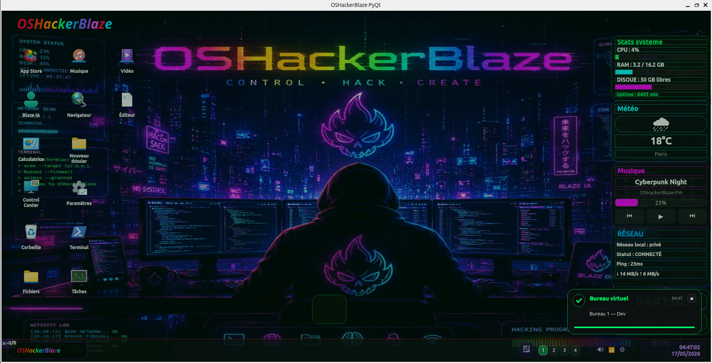
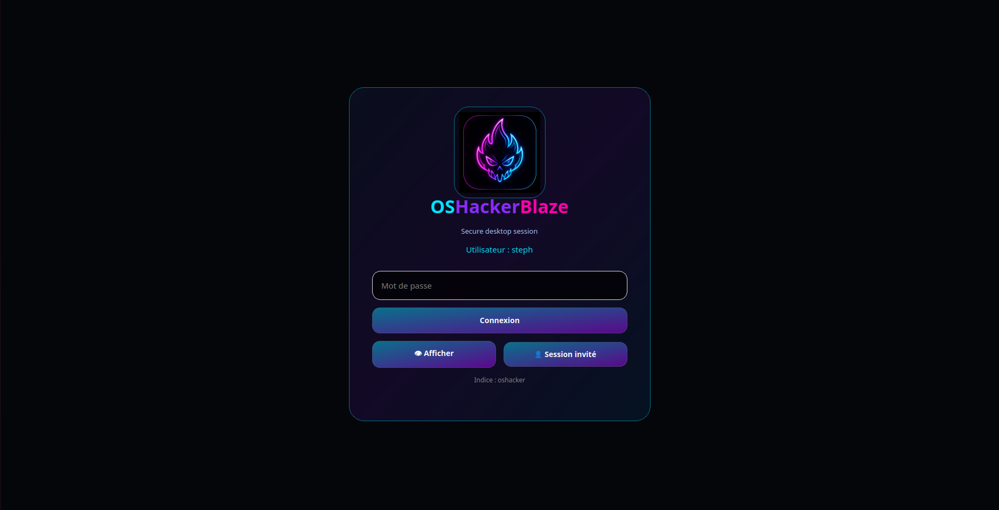
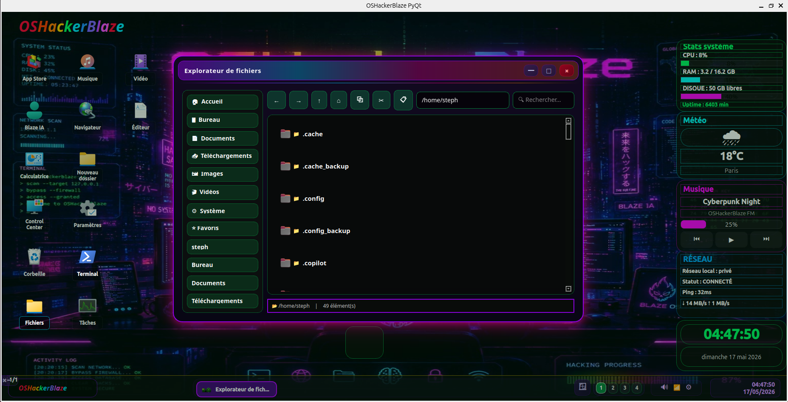
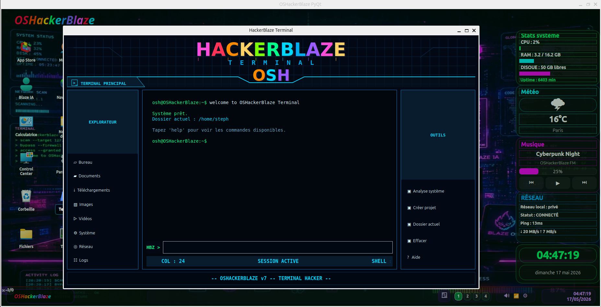
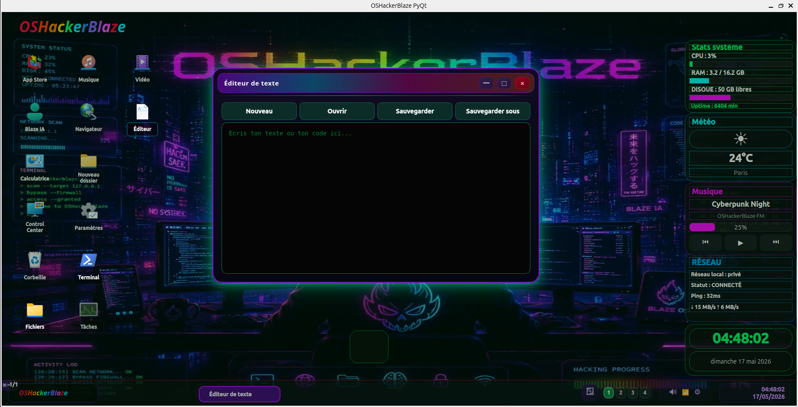
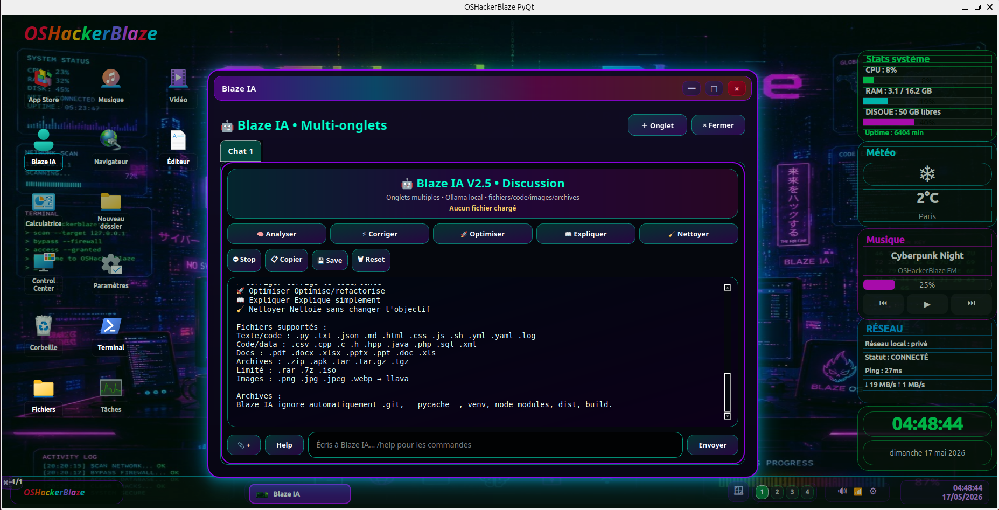
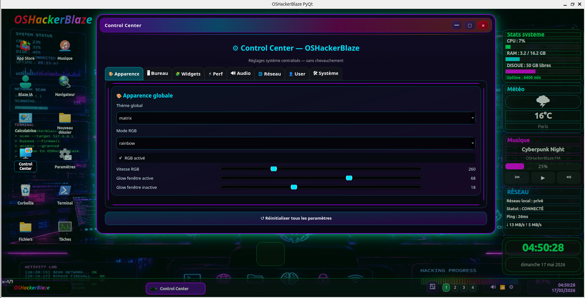
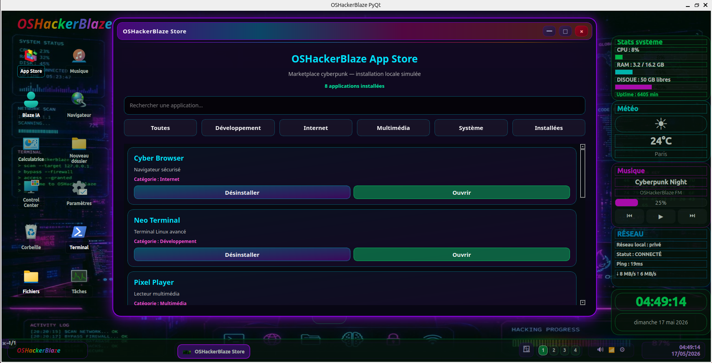

# OSHackerBlaze Showcase

Projet personnel de développement d’un environnement desktop Linux en Python/PyQt6.

Ce dépôt public sert de vitrine pour présenter mon travail dans le cadre de ma reconversion vers l’informatique et le développement Python.

> Le code complet du projet est conservé dans un dépôt privé. Ce dépôt public présente uniquement le projet, les captures d’écran et les compétences travaillées.

---

## Présentation

OSHackerBlaze est un projet personnel d’interface desktop développé sous Linux avec Python et PyQt6.

L’objectif est de progresser sur un projet concret autour de :

- développement Python
- interfaces graphiques avec PyQt6
- architecture modulaire
- Linux / Ubuntu
- Git et GitHub
- résolution de bugs
- logique de développement logiciel

---

## Technologies utilisées

- Python
- PyQt6
- Linux / Ubuntu
- Git / GitHub
- Machines virtuelles

---

## Fonctionnalités visibles

- Bureau personnalisé
- Écran de connexion
- Terminal intégré
- Explorateur de fichiers
- Éditeur de texte
- Paramètres système
- Assistant IA local
- Store interne
- Widgets système

---

## Captures d’écran

### Bureau principal

### Écran de connexion

### Explorateur de fichiers

### Terminal intégré

### Éditeur de texte

### Assistant IA

### Paramètres

### Store interne

---

## Compétences travaillées

- Organisation d’un projet Python
- Modularisation du code
- Création d’interfaces graphiques
- Utilisation de Linux / Ubuntu
- Utilisation de Git et GitHub
- Correction de bugs
- Amélioration continue d’un projet personnel

---

## Auteur

**Stéphane Pressoir**  
Reconversion informatique – Python / Linux junior
